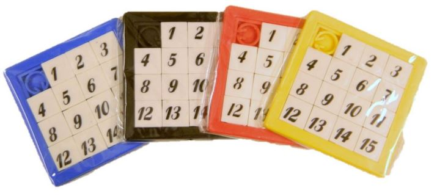
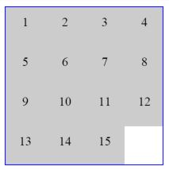

# ReactJS workshop 

I'm assuming you already went throgh [first workshop](https://github.com/ryanez/react-workshop-first)

# The setup

- Create a directory for the project and then run `npm init`, follow your instincts to answer the wizard's questions.
- Install React and its dependencies `npm install react react-dom babelify --save-dev`

**Note**: At the moment of writing this tutorial the current version of react/react-dom/babelify are:
* "babelify": "^7.2.0",
* "react": "^0.14.2",
* "react-dom": "^0.14.2"


# Index file

- On root directory create `.\ui` & `.\public` directories.
- Create the index file `.\ui\index.js`

```Javascript
'use strict';

var React = require('react'),
    ReactDOM = require('react-dom');

// designed to be called once document is loaded.
module.exports = function(elementId) {
    var element = global.document.getElementById(elementId);

    ReactDOM.render(React.createElement('div', null, 'here we will initialize the awesome'), element);
};
```

# Browserify

You must have globaly installed browserify at this point (if you don't `npm install -g browserify`), so let's bundle our index file.

`browserify ui/index.js -o public/game.js -s rockandroll`

# Index.html

Lets create a HTML file that renders our React Application, create `index.html` on root directory.

```Html
<!DOCTYPE html>
<html>
<head>
    <title>ReactJS Second Workshop</title>
    <script type="text/javascript" src="public/game.js"></script>
</head>
<body onload="rockandroll('container')">
    <div id="container">Hello world!</div>
</body>
</html>
```

**Note:** `rockandroll` is the `-s rockandroll` parameter we set while browserifying and we call `rockandroll('container')` because it's the elment Id.

Now we can open `index.html` on browser and see how the "Hello world!" is replaced by our ReactJS component.

# Babelify

As you noticed we are calling directly the `React` api to render components, in other words, not using **JSX** yet, lets use it.

```Javascript
'use strict';

var React = require('react'),
    ReactDOM = require('react-dom');

// designed to be called once document is loaded.
module.exports = function(elementId) {
    var element = global.document.getElementById(elementId);

    ReactDOM.render(<div>Initialize the awesome ;)</div>, element);
};
```

Try to run again our old browserify command and see how it explodes in your face (`browserify ui/index.js -o public/game.js -s rockandroll`).
As you remember we've installed *babelify* among *react* and *react-dom*, *babelify* is the transformer that *browserify* will use to convert from **JSX** to regular **Javascript**.

`browserify -t babelify ui/index.js -o public/game.js -s rockandroll`

More errors Uhh?

Babelify will need a little help with the *JSX* syntax and *React*, install `npm install --save-dev babel-preset-react`, now lets use:

`browserify -t [ babelify --presets [ react ] ] ui/index.js -o public/game.js -s rockandroll`

Probably it's time to add this command to our `package.json` file.

```Json
"scripts": {
    "build": "browserify -t [ babelify --presets [ react ] ] ui/index.js -o public/game.js -s rockandroll",
    "watch": "watchify -t [ babelify --presets [ react ] ] ui/index.js -o public/game.js -s rockandroll"
}
```

Now we can run `npm run build` or `npm run watch` for continuos building.

# The Game

We want to build our digital version of the **Rompecocos game**



# CSS

Lets write some *CSS* code on `./public/styles.css`

```CSS
.container {
    margin: 0 auto;
    border: solid 1px blue;
    overflow: hidden;
    box-sizing: border-box;
    position: relative;
}

.square {
    width: 50px;
    height: 50px;
    text-align: center;
    box-sizing: border-box;
    position: absolute;
    background: #ccc;
    cursor: pointer;
    padding-top: 10px;
}
```

Do not forget to add the styesheet reference on the `<head>` of the page
```Html
<head>
    <title>ReactJS Second Workshop</title>
    <link rel="stylesheet" type="text/css" href="public/styles.css">
    <script type="text/javascript" src="public/game.js"></script>
</head>
```

We will create two *React* components to build our game, the **Container** and the **Square**.

* **Square** is the small piece of the game that represents a number that can be moved accross the **Container**
* **Container** is the box in which the **Squares** are rendered inside.

# The Square Component

Create a file `./ui/square.js`

```Javascript
'use strict';

var React = require('react');

module.exports = React.createClass({
    displayName: 'Square',

    propTypes: {
        index: React.PropTypes.number.isRequired,
        number: React.PropTypes.number.isRequired
    },

    render: function() {
        var style = {
            left: (this.props.index % this.props.cols) * 50 + 'px',
            top: Math.floor(this.props.index / this.props.cols) * 50 + 'px'
        };

        return (<div className="square" style={style}>{this.props.number}</div>);
    }
});
```

The maths here are very simple the `"row = index / numberOfColumns"` and the `"col = index % numberOfColumns"` 
once we calculated that number we multiply for the square height and width respectively.

Now that we have our square component that we might [reuse](https://facebook.github.io/react/docs/reusable-components.html).

# The Container Component

Create a file `./ui/contanier.js`

```Javascript
'use strict';

var React = require('react'),
    _ = require('underscore'),
    Square = require('./square');

module.exports = React.createClass({
    displayName: 'Container',

    propTypes: {
        rows: React.PropTypes.number,
        cols: React.PropTypes.number
    },

    getDefaultProps: function() {
        return {
            rows: 4,
            cols: 4
        };
    },

    getInitialState: function() {
        return {
            squares: this.initSquares() 
        };
    },

    initSquares: function() {
        var targetSquares = this.props.rows * this.props.cols,
            squares = _.range(1, targetSquares);

        squares.push(null);
        return squares;
    },

    createSquare: function(number, index) {
        return number ? 
            (<Square number={number} key={number} index={index} cols={this.props.cols}/>) 
            : null;
    },

    render: function() {
        var squares = _.map(this.state.squares, this.createSquare),
            style = {
                width: (50 * this.props.cols) + 'px',
                height: (50 * this.props.rows) + 'px'
            };

        return (<div className="container" style={style}>{squares}</div>);
    }
});
```

Our `Container` *React Component* is the responsible of create and contain the *Squares*, we defined two optional properties
`rows` and `cols` as numeric, then we assigned the default value to `rows: 4, cols:4`. 

The `getInitialState()` method will create an `array of numbers` that will contain the `[cols * rows]` slots we need to 
represent our *Squares* on the game. **Note:** that the array is not a *matrix[cols][rows]* we will do the maths to break it down
into a logical matrix of _[cols][rows]_.

If you try to `npm run build` you will get an error. We are missing to install the *underscore* library. Lets install it
`npm install --save-dev underscore`.

At this point we should see something like this:



As you might notice we have our empty slot at the end of the container, this is because we are adding a null element at the end
of the list, lets insert that empty one at the very beginning rather than into the end.

~~sqares.push(null);~~
```Javascript
squares.splice(0, 0, null);
```

# This dance needs some sexy moves

Lets add some event handling to our *Square* component.

```Javascript
    render: function() {
        var index  = this.props.index,
            number = this.props.number,
            cols = this.props.cols,
            style = {
            left: (index % cols) * 50 + 'px',
            top: Math.floor(index / cols) * 50 + 'px'
        };

        return (<div onClick={this.props.onSquareClick.bind(this, index, number)}
            className="square" style={style}>{this.props.number}</div>);
    }
```

There are a few changes you may notice on the *Square's* `render()` method.

* We've added `index, number, cols` vars to make code more readable
* `onClick` this event is the `ReactJS` handler that the framework will attach to the DOM `<element>`
* `this.props.onSquareClick` we are making a dangerous assumption, that this propery will have a valid `function` reference
* `this.props.onSquareClick.bind` we are [binding](https://developer.mozilla.org/en/docs/Web/JavaScript/Reference/Global_objects/Function/bind) that `function` to our component and `(index, number)` arguments.

What if the `onSquareClick` property is `null`? We have two options here

1. To make this propery required
```Javascript
    propTypes: {
        index: React.PropTypes.number.isRequired,
        number: React.PropTypes.number.isRequired,
        onSquareClick: React.PropTypes.func.isRequired
    },
```
2. To define a default property value set to empty `function`.
```Javascript
    propTypes: {
        index: React.PropTypes.number.isRequired,
        number: React.PropTypes.number.isRequired,
        onSquareClick: React.PropTypes.func
    },

    getDefaultProps: function() {
        return {
            onSquareClick: function() {}
        };
    },
```

The `click` event handler is not defined inside our *Square* component because it doesn't know how to handle it, 
rather than that it will notify its *parent*, because parent is the one that assigned the `<Square onSquareClick=eventHandler />`.

# Time to party

We said that parent will be resposible of event handling and that takes us to our *Container* component.

```Javascript
    onSquareClick: function(index, number) {
        var options = [
                index - 1, //left
                index + 1, //right
                index - this.props.cols, // top
                index + this.props.cols //bottom
            ],
            targetSquares = this.props.rows * this.props.cols,
            squares = this.state.squares,
            moveTo = _.find(options, function(option) {
                return option >= 0 && option < targetSquares && squares[option] === null;
            });

        if (!isNaN(moveTo)) {
            squares[index] = null;
            squares[moveTo] = number;
            this.setState({
                squares: squares
            });
        }
    },

    createSquare: function(number, index) {
        return number ? 
            (<Square number={number} key={number} index={index} cols={this.props.cols}
                onSquareClick={this.onSquareClick}/>) 
            : null;
    },
```

Lets start for the easiest part

* `createSquare` method is now assiging `onSquareClick` property of *Square*, there are some factors to notice here:
    - `onSquareClick={this.onSquareClick}`, **this** is the *Container* instance, remember that react bind all functions to the Component instance.
    - We are trasnfering the same `onSquareClick` handler to all the *Square*s instances,
    - That's why each *Square* instance creates its own **binded** reference to this handler.
* `onSquareClick` this event handler has two arguments `(index, number)`
    - `index` is the position in the *array* of the element that triggered the event.
    - `number` is the displaying number on the *Square*
* What we need to do is to find if there is an empty slot close to the *Square* that triggered the event.
    - The left slot is `index - 1`
    - The right slot is `index + 1`
    - The slot above is `index - cols` [do the maths ;)]
    - The slot below is `index + cols` [again don't be that lazzy]
    - Now we use *underscore*'s `_.find` to look the empty slot, while beign careful with ranges.
* If we find an empty slot close to the given *Square* (`!isNaN`) we clear the current index and move the number to the empty slot.
    * By calling `this.setState` will triger *ReactJS* rendering mechanisims